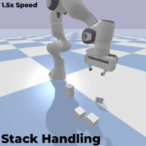
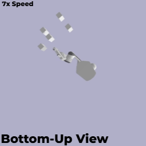
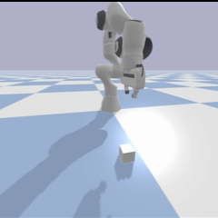
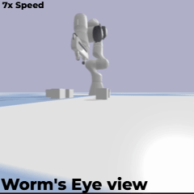

<div align="center">

# Panda Robot Pick & Place

</div>


## Overview


*Autonomous environment cleanup with 4 objects — full scan, sort, and placement cycle*

---

## Feature Showcase

<table>
<tr>
<td width="50%">

### Intelligent Stack Deconstruction



**Z-Sort Algorithm** automatically detects vertical stacks and deconstructs them top-down, preventing tower collapse during sequential manipulation.

</td>
<td width="50%">

### Phantom Target Precision



**Underside perspective** validates full gripper contact with the ground plane — the phantom target strategy forces steep approach angles to overcome IK limitations.

</td>
</tr>
</table>

---

## Robot Workflow

<div align="center">



</div>

### Seven-Phase Manipulation Cycle

1.  **Phase I: Approach**
    Rapid transit to safety hover altitude ($Z=0.2m$) to clear workspace obstacles.

2.  **Phase II: Alignment**
    Precise wrist orientation synchronization and gripper width adjustment at preparation height ($Z=0.1m$).

3.  **Phase III: Descent**
    Movement towards a virtual target below the floor level ($Z_{target} < Z_{surf}$). This forces the arm to extend fully for a secure grip.

4.  **Phase IV: Grasp**
    Actuation of gripper fingers followed by a static stabilization delay to resolve physics collisions.

5.  **Phase V: Lift**
    Vertical extraction to safe transport altitude, preventing lateral collisions with neighboring stacks.

6.  **Phase VI: Relocation**
    Smooth trajectory execution towards the Drop Zone coordinates using inverse kinematics.

7.  **Phase VII: Drop**
    Controlled object release and immediate transition to the next target in the queue.
---

## Engineering Perspective

<div align="center">



*Worm's-eye view revealing full kinematic chain during ground-level manipulation*

</div>

---


## Key Algorithms

### Phantom Target Strategy
Overcomes IK singularities by shifting the grasp target below the object's geometric center.
$$Z_{target} = Z_{center} - \delta \quad (\text{where } \delta = 0.03m)$$
This offset forces the gripper to approach aggressively, ensuring full contact with the object surface.

### Stack Intelligence (Z-Sort)
Prevents tower collapse by processing objects in a strict top-down order. The sorting logic ensures that for any sequence of targets $O_1, O_2, \dots, O_n$:
$$Z(O_1) \ge Z(O_2) \ge \dots \ge Z(O_n)$$
Where $Z(O)$ is the height of the object's centroid.

### AABB Centroids
Calculates grasp points using Axis-Aligned Bounding Boxes to ignore mesh rotation. The target is derived simply as:
$$P_{grasp} = \frac{Min_{xyz} + Max_{xyz}}{2}$$
This guarantees a stable grasp point regardless of the object's orientation.

### Wrist Normalization
Exploits the **4-fold rotational symmetry** of a cube. Since the object looks identical every $90^\circ$ ($\frac{\pi}{2}$), we map the grasp angle $\theta$ to the minimal range:
$$\theta' = \theta \pmod{\frac{\pi}{2}} \in [-\frac{\pi}{4}, \frac{\pi}{4}]$$
This eliminates redundant rotations and keeps the wrist joints within optimal limits.

---

## Launch

### Windows
```bash
setup.bat
run.bat
```

### Linux/MacOS
```bash
chmod +x setup.sh run.sh
./setup.sh
./run.sh
```

---
<div align="center">

### Tech stack

[](https://skillicons.dev)

</div>
